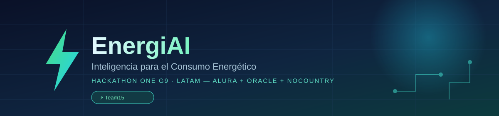
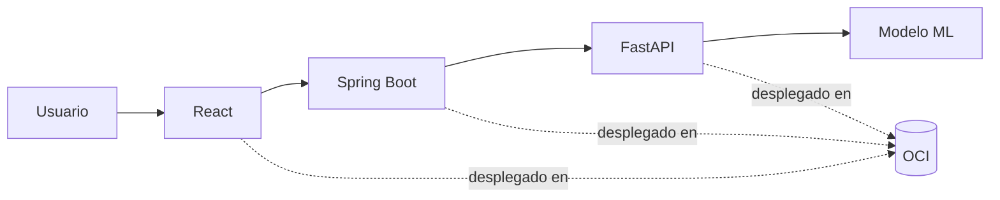

[](LICENSE)


# EnergiAI

EnergiAI clasifica el consumo eléctrico residencial en **Eficiente**, **Moderado** o **Ineficiente**, estima el costo mensual y genera recomendaciones de ahorro a partir de un modelo de Machine Learning. Proyecto construido para el **Hackathon ONE G9-LATAM** (Alura + Oracle + NoCountry).

---

## Demo en vivo

**[http://149.130.187.192](http://149.130.187.192)**

> ⚠️ No es infraestructura de producción 24/7 — es la Container Instance del hackathon en OCI, puede no estar siempre activa.

---

## Arquitectura



Diagrama completo de contenedores: [`diagrams/02-C4-Nivel-2-Contenedores.md`](diagrams/02-C4-Nivel-2-Contenedores.md)

---

## Stack tecnológico

| Capa | Tecnología |
|---|---|
| **Frontend** | React 18 + Vite + Tailwind CSS, servido por Nginx |
| **Backend** | Java 21 + Spring Boot 3.2.3 (Web, Validation, Actuator) |
| **ML** | Python 3.12 + FastAPI + Scikit-Learn (RandomForest) |
| **Infra** | Docker + Docker Compose (local) — OCI Container Instance + OCIR (nube) |

---

## Documentación

**Arquitectura y contratos**
- [Arquitectura Empresarial y MVP](architecture/03-Arquitectura-Empresarial-EnergiAI.md)
- [Contrato de Integración v1 (Frontend↔Backend)](architecture/contracts/API_CONTRACT_V1.md)
- [Contrato Interno (Backend↔ML Service)](architecture/contracts/CONTRATO_INTERNO_BACKEND_ML.md)
- [ADR-001 — Contrato de Integración](architecture/decisions/ADR-001-contrato-integracion-v1.md)
- [ADR-002 — Motor de Recomendaciones en Backend](architecture/decisions/ADR-002-motor-recomendaciones-backend.md)

**Diagramas**
- [C4 Nivel 2 — Contenedores](diagrams/02-C4-Nivel-2-Contenedores.md)
- [C4 Nivel 3 — Componentes del Backend](diagrams/03-C4-Nivel-3-Componentes.md)
- [Diagrama de Secuencia — Análisis Energético](diagrams/04-Diagrama-Secuencia-Analisis-Energetico.md)

**Despliegue**
- [Despliegue OCI](infra/oci/README.md)

**Índice completo**
- [Índice Maestro de Documentación](docs/00-Indice-Arquitectura.md)

**Ciencia de datos**
- 📊 Notebook de Ciencia de Datos — 🟡 En construcción, publicación esperada esta semana

**Motor de recomendaciones**
- [Auditoría del Motor de Recomendaciones](docs/architecture/MOTOR_RECOMENDACIONES_v1.md)

---

## Equipo

Equipo activo a partir del [Acta 007](meetings/ActaReunion-007-ENERGIAI.md) (2026-08-03): 7 integrantes.

| Integrante | Rol |
|---|---|
| Luis Angel Chavez Mejia | Product Owner |
| Bernardo Gomez | Software Architect |
| Harrinson Villabona | Data Scientist |
| Carlos Fabian Mesa | Backend Developer |
| Elvis Trinidad | Backend Developer |
| Magno Cristian Coronel | Data Analyst |
| Alonso Carbajal | Full Stack Developer |

> **Nota:** Anayely Reyes (Data Engineer) no continuó en la simulación ([Acta 007](meetings/ActaReunion-007-ENERGIAI.md) §1). La redistribución formal de su rol sigue pendiente — ver [`planning/05-Backlog-Sprint2-ENERGIAI.md`](planning/05-Backlog-Sprint2-ENERGIAI.md), Tarea #16.

Referencia completa: [`planning/01-Roles.md`](planning/01-Roles.md)

---

## Cómo correr el proyecto localmente

Requiere Docker y Docker Compose.

```bash
git clone https://github.com/No-Country-simulation/EnergiAI-G9-Latam-Team15.git
cd EnergiAI-G9-Latam-Team15
docker-compose up --build
```

Por defecto:

| Servicio | URL local |
|---|---|
| Frontend | http://localhost:5180 |
| Backend | http://localhost:8080 |
| ML Service | http://localhost:8000 |

---

## 📚 Documentación adicional

- **Visión General:** [architecture/01-Vision-General.md](architecture/01-Vision-General.md)
- **Objetivo del Hackathon:** MVP demostrable que entregue el flujo *dato de consumo → clasificación → recomendación → visualización → evidencia OCI*, con foco en usuario residencial.
- **Roadmap Técnico:** [planning/03-Roadmap-Tecnico-5-Semanas.md](planning/03-Roadmap-Tecnico-5-Semanas.md)
- **Estrategia GitFlow:** [docs/01-Estructura-Repositorio-y-GitFlow.md](docs/01-Estructura-Repositorio-y-GitFlow.md)
- **Dataset — investigación y estrategia:** [docs/data-engineering/](docs/data-engineering/)

---

## Licencia

Este proyecto se distribuye bajo la licencia [MIT](LICENSE).
