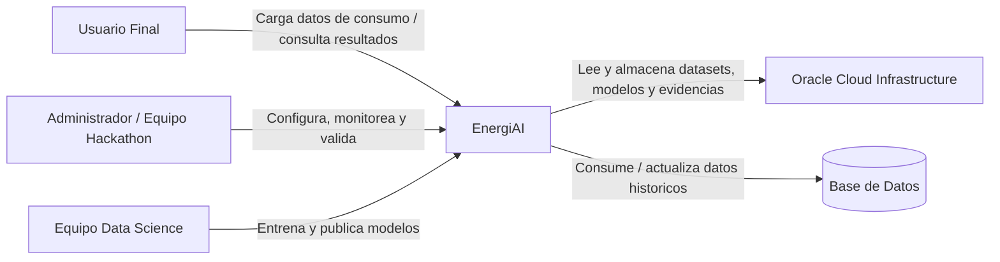

# C4 Nivel 1 - Contexto del Sistema EnergiAI

**Fecha:** 2026-07-13  
**Objetivo:** Representar el sistema EnergiAI en su contexto de negocio y sus interacciones externas.

## Descripcion

EnergiAI se posiciona como una plataforma de analitica energetica que recibe datos de consumo, ejecuta clasificacion de eficiencia y entrega resultados comprensibles al usuario final y al equipo del hackathon.

## Diagrama

## Actores y sistemas

- **Usuario Final:** Persona que desea conocer su nivel de eficiencia energetica.
- **Administrador / Equipo Hackathon:** Opera, valida resultados y prepara la demo.
- **Equipo Data Science:** Entrena y ajusta los modelos de clasificacion.
- **EnergiAI:** Sistema principal que integra experiencia digital, negocio e inteligencia analitica.
- **OCI:** Plataforma cloud para despliegue, almacenamiento y servicios base.
- **Base de Datos:** Repositorio transaccional para usuarios, consumos y clasificaciones.

## Alcance del sistema

Dentro del limite del sistema EnergiAI se incluyen:

- Frontend web
- API backend
- Servicio de inferencia ML
- Persistencia de resultados
- Integracion con servicios OCI
