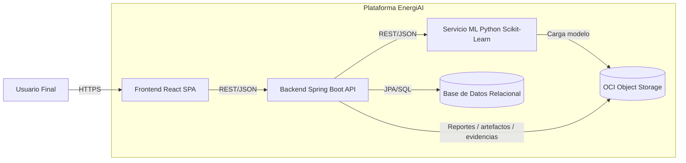

# C4 Nivel 2 - Contenedores de EnergiAI

**Fecha:** 2026-07-13  
**Objetivo:** Describir los contenedores logicos principales del sistema y sus responsabilidades.

## Diagrama

## Contenedores

### Frontend React SPA

- Presenta dashboard, formularios y resultados.
- Consume APIs del backend.
- No contiene logica critica de negocio.

### Backend Spring Boot API

- Expone contratos REST.
- Orquesta persistencia, validacion y trazabilidad.
- Invoca el servicio ML.
- Devuelve clasificacion y recomendaciones al frontend.

### Servicio ML Python Scikit-Learn

- Realiza preprocesamiento e inferencia.
- Expone endpoint de scoring.
- Gestiona la carga del modelo aprobado.

### Base de Datos Relacional

- Almacena usuarios, mediciones, clasificaciones e historico.
- Soporta consultas para dashboard y auditoria basica.

### OCI Object Storage

- Guarda datasets, modelos serializados, reportes y evidencias.
- Actua como repositorio de artefactos analiticos.

## Relaciones clave

- **React -> Spring Boot:** contrato estable para experiencia y negocio.
- **Spring Boot -> Python ML:** desacoplamiento tecnologico y evolucion independiente.
- **Spring Boot -> DB:** persistencia transaccional.
- **Python / Spring Boot -> Object Storage:** trazabilidad de activos del proyecto.
