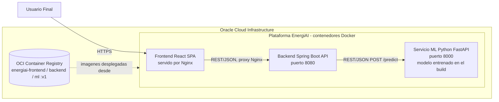

# C4 Nivel 2 - Contenedores de EnergiAI

**Fecha original:** 2026-07-13
**Última revisión:** 2026-08-05 — actualizado para reflejar el sistema realmente desplegado en OCI, no la arquitectura objetivo. La versión objetivo (con base de datos y Object Storage) sigue vigente como dirección de evolución — ver `architecture/03-Arquitectura-Empresarial-EnergiAI.md` §8 y DA-05.
**Objetivo:** Describir los contenedores logicos principales del sistema y sus responsabilidades.

## Diagrama (arquitectura real, 2026-08-05)

```mermaid
flowchart LR
    User[Usuario Final]

    subgraph OCI[Oracle Cloud Infrastructure]
        subgraph EnergiAI[Plataforma EnergiAI - contenedores Docker]
            FE[Frontend React SPA<br/>servido por Nginx]
            BE[Backend Spring Boot API<br/>puerto 8080]
            ML[Servicio ML Python FastAPI<br/>puerto 8000<br/>modelo entrenado en el build]
        end
        OCIR[(OCI Container Registry<br/>energiai-frontend / backend / ml :v1)]
    end

    User -->|HTTPS| FE
    FE -->|REST/JSON, proxy Nginx| BE
    BE -->|REST/JSON POST /predict| ML
    OCIR -.->|imagenes desplegadas desde| EnergiAI
```

## Contenedores

### Frontend React SPA

- Presenta formulario de consumo, semáforo de eficiencia, historial y recomendaciones.
- Consume la API del backend vía proxy Nginx (`frontend/nginx.conf`, `VITE_API_URL` relativa).
- Historial guardado únicamente en el navegador (`useHistorial.js`) — no hay persistencia server-side.
- No contiene lógica crítica de negocio (el motor de recomendaciones del frontend es solo fallback de contingencia, ver DA-06).

### Backend Spring Boot API

- Expone `POST /api/v1/analisis-energetico` y `GET /health` (vía Actuator).
- Valida payloads (`AnalisisRequestDTO` con Bean Validation).
- Invoca el servicio ML (`MlClient` → `POST /predict`) y agrega costo estimado + recomendaciones.
- Sin persistencia de histórico (deuda técnica reconocida, ver `architecture/03-Arquitectura-Empresarial-EnergiAI.md` §8.2).

### Servicio ML Python (FastAPI + Scikit-Learn)

- Entrena el modelo (RandomForest) **dentro del build de su propia imagen Docker** (`ml-service/train.py` ejecutado en `ml-service/Dockerfile`) — no carga un artefacto externo desde Object Storage.
- Expone `POST /predict` y `GET /health`.
- Contrato detallado en `architecture/contracts/CONTRATO_INTERNO_BACKEND_ML.md`.

### OCI Container Registry (OCIR)

- Repositorio de las 3 imágenes del stack (`energiai-frontend`, `energiai-backend`, `energiai-ml`, tag `:v1`), origen del despliegue en OCI.

## Contenedores de la arquitectura objetivo — no implementados aún

Se mantienen documentados porque siguen siendo la dirección de evolución (ver DA-05 y §8 de `architecture/03-Arquitectura-Empresarial-EnergiAI.md`), pero **no existen hoy en el sistema desplegado**:

- **Base de Datos Relacional** — persistencia de usuarios, mediciones, clasificaciones e histórico.
- **OCI Object Storage** — repositorio de datasets, modelos serializados versionados, reportes y evidencias, independiente del ciclo de build de las imágenes.

## Relaciones clave

- **React -> Spring Boot:** contrato estable `API_CONTRACT_V1.md`, vía proxy Nginx en producción.
- **Spring Boot -> Python ML:** contrato interno `CONTRATO_INTERNO_BACKEND_ML.md`, desacoplamiento tecnológico.
- **Spring Boot -> DB / Python -> Object Storage:** relaciones de la arquitectura objetivo, aún no materializadas.
