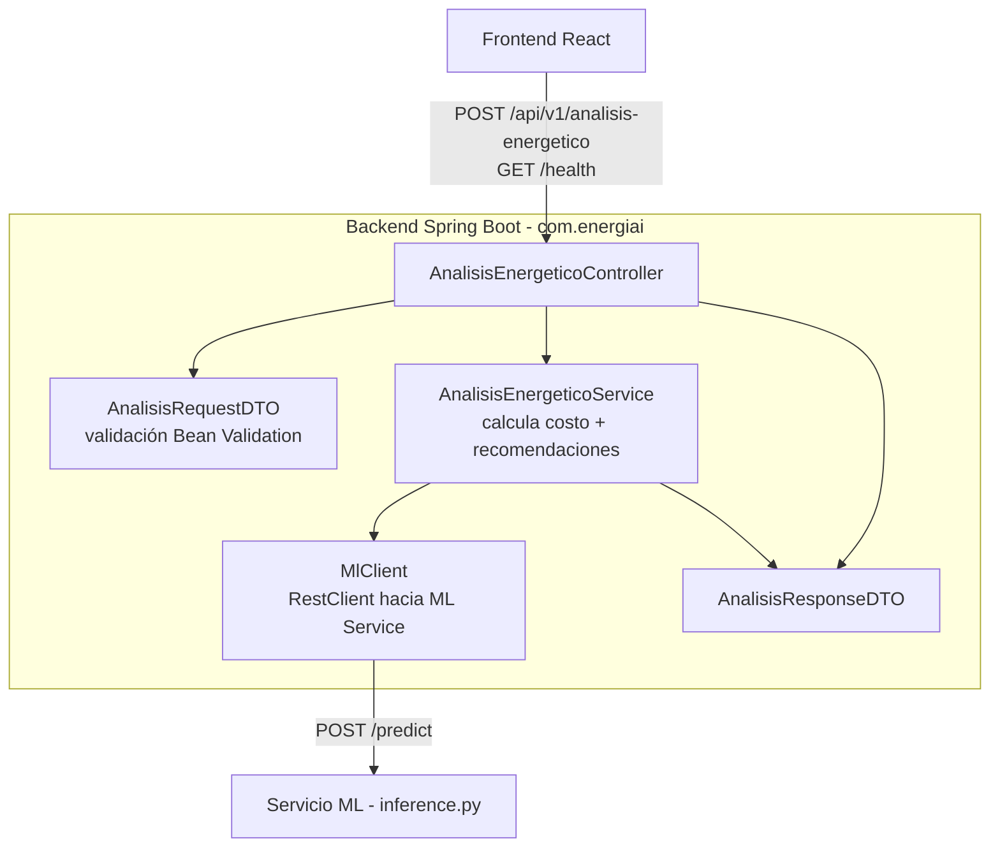

# C4 Nivel 3 - Componentes del Backend EnergiAI

**Fecha:** 2026-08-05
**Objetivo:** Descomponer el contenedor "Backend Spring Boot API" en sus componentes internos, derivados directamente del código real en `backend/src/main/java/com/energiai/`. Cierra el gap documentado en `docs/governance/AUDITORIA_PROYECTO_v1.md` §3.1 ("no hay diagrama C4 Nivel 3").

## Alcance

Solo se detalla el Backend porque es el único contenedor con lógica interna no trivial. El Frontend (SPA) y el ML Service (un único módulo FastAPI de inferencia) no justifican un diagrama de componentes propio en el estado actual del MVP.

## Diagrama

## Componentes

### AnalisisEnergeticoController

- Expone `POST /api/v1/analisis-energetico` y delega en `AnalisisEnergeticoService`.
- `GET /health` se expone vía Spring Boot Actuator (`spring-boot-starter-actuator`), no como controller propio.

### AnalisisRequestDTO / AnalisisResponseDTO

- `record` de Java con anotaciones de Bean Validation (`@NotNull`, `@Positive`, `@PositiveOrZero`) mapeadas a los nombres de campo del contrato vía `@JsonProperty` (p. ej. `consumoKwh` ↔ `consumo_kwh`).
- Errores de validación se traducen automáticamente a 400 por Spring (`spring-boot-starter-validation`); no hay un `@ControllerAdvice` custom todavía — deuda pendiente si se necesita el formato de error exacto de `API_CONTRACT_V1.md` (`status/code/message`).

### AnalisisEnergeticoService

- Único punto de lógica de negocio del backend.
- Calcula `costo_estimado_mensual` (`consumo_kwh × 0.75`, tarifa hardcodeada como constante `TARIFA_REFERENCIA_KWH`).
- Hoy retorna 3 recomendaciones fijas (ver ADR-002, pendiente portar las 8 reglas reales).
- Envuelve la llamada a `MlClient` en `try/catch`: si el ML Service falla, responde con `categoria = "Ineficiente"`, `probabilidad = 0.81` como fallback silencioso (mismo patrón de resiliencia que el mock de frontend, ver `CONTRATO_INTERNO_BACKEND_ML.md`).

### MlClient

- Componente Spring (`@Component`) que encapsula la llamada HTTP al ML Service vía `RestClient`.
- URL configurable por `ML_SERVICE_URL` (env var), default `http://localhost:8000`.
- Contrato completo en `architecture/contracts/CONTRATO_INTERNO_BACKEND_ML.md`.

## Documentos relacionados

- `diagrams/02-C4-Nivel-2-Contenedores.md`
- `diagrams/04-Diagrama-Secuencia-Analisis-Energetico.md`
- `architecture/contracts/API_CONTRACT_V1.md`
- `architecture/contracts/CONTRATO_INTERNO_BACKEND_ML.md`
