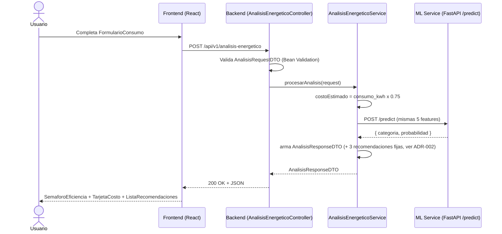
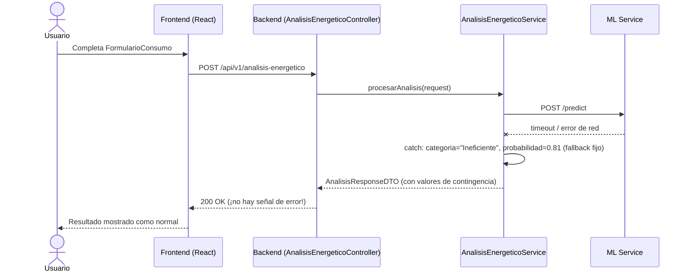
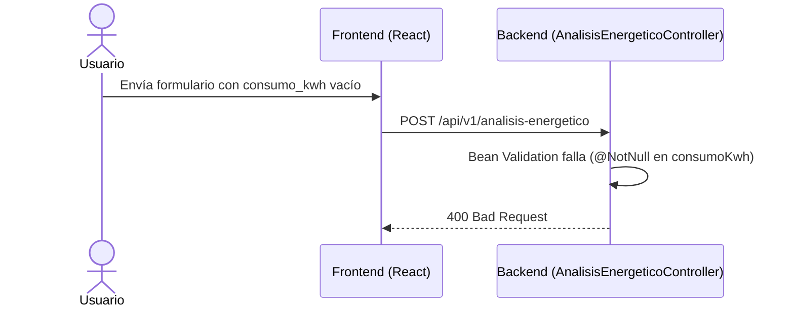

# Diagrama de Secuencia — POST /api/v1/analisis-energetico

**Fecha:** 2026-08-05
**Objetivo:** Documentar el flujo real end-to-end verificado en la demo del 2026-08-04 (`meetings/ActaReunion-008-ENERGIAI.md`), incluyendo el camino de fallo. Cierra el gap señalado en `docs/governance/AUDITORIA_PROYECTO_v1.md` §3.1.

## Camino feliz

## Camino de fallo — ML Service no disponible

**Nota de riesgo (ver `architecture/contracts/CONTRATO_INTERNO_BACKEND_ML.md`):** el fallback del backend responde `200 OK` incluso cuando el ML Service falló — el usuario no tiene forma de distinguir una predicción real de una de contingencia. Es una decisión deliberada de resiliencia de demo, pero debe quedar explícita para quien opere el sistema en producción.

## Camino de validación fallida (400)

## Documentos relacionados

- `diagrams/03-C4-Nivel-3-Componentes.md`
- `architecture/contracts/API_CONTRACT_V1.md`
- `architecture/contracts/CONTRATO_INTERNO_BACKEND_ML.md`
