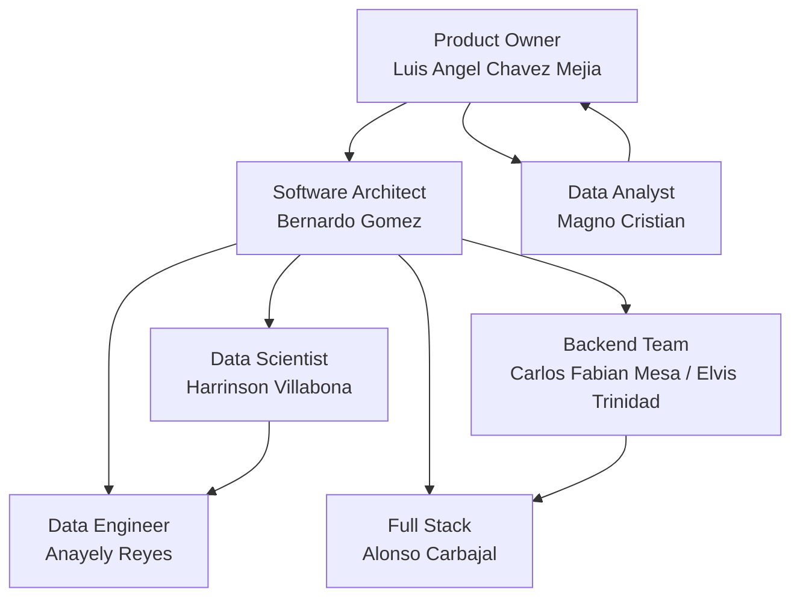

# GUIA MAESTRA DEL PROYECTO ENERGIAI

**Proyecto:** EnergiAI  
**Programa:** Hackathon EnergiAI - Oracle + Alura  
**Nivel documental:** PMO Director / Enterprise Software Architect / Scrum Master Senior / Technical Lead / Delivery Manager  
**Fecha:** 2026-07-13  
**Estado:** Documento rector vigente  
**Clasificacion:** Uso interno del equipo de proyecto  

---

## 1. Portada Profesional

### 1.1 Identificacion del documento

- **Nombre oficial:** Guia Maestra del Proyecto EnergiAI
- **Codigo documental:** ENA-PMO-ARCH-MASTER-001
- **Version:** 1.0
- **Propietario del documento:** Software Architect
- **Aprobadores iniciales:** Product Owner + Equipo base del proyecto
- **Objetivo del documento:** Actuar como manual operativo, tecnico, metodologico y estrategico integral del proyecto.

### 1.2 Proposito

Esta guia debe permitir que cualquier integrante actual o futuro pueda:

- comprender el contexto del proyecto,
- conocer el alcance real del MVP,
- identificar responsabilidades y dependencias,
- retomar el trabajo ante ausencias o retrasos,
- y ejecutar el proyecto con continuidad operativa.

---

## 2. Control de versiones

| Version | Fecha | Autor / Rol | Cambio realizado | Estado |
|---|---|---|---|---|
| 1.0 | 2026-07-13 | AI Assistant / Arquitectura y PMO | Emision inicial de la guia maestra | Vigente |

### 2.1 Politica de versionado documental

- Cambios menores: ajuste editorial, aclaraciones, formato.
- Cambios medios: actualizacion de alcance, roadmap, backlog o responsables.
- Cambios mayores: redefinicion del MVP, arquitectura, estrategia cloud o gobierno del proyecto.
- Todo cambio debe registrar fecha, responsable y motivo.

---

## 3. Indice automatico

Esta guia esta estructurada con encabezados jerarquicos compatibles con generacion automatica de tabla de contenido al exportar a Microsoft Word.

### Tabla de contenido

1. Portada Profesional
2. Control de versiones
3. Indice automatico
4. Resumen ejecutivo
5. Contexto del Hackathon
6. Objetivos del proyecto
7. Alcance del MVP
8. Alcance futuro
9. Restricciones del Hackathon
10. Entregables obligatorios
11. Equipo de trabajo
12. Roles oficiales asignados por NoCountry
13. Responsabilidades por rol
14. Responsabilidades cruzadas
15. Matriz RACI
16. Organigrama operativo
17. Metodologia Scrum adaptada para Hackathon
18. Sprint 0
19. Sprint 1
20. Sprint 2
21. Sprint 3
22. Sprint 4
23. Sprint 5
24. Arquitectura empresarial
25. Arquitectura MVP
26. Arquitectura OCI
27. Diagramas C4
28. Estrategia GitFlow
29. Convenciones de desarrollo
30. Gestion documental
31. Roadmap tecnico
32. Backlog inicial
33. Historias de usuario
34. MVP minimo indispensable
35. Funcionalidades diferenciales
36. Estrategia para ganar el Hackathon
37. Gestion de riesgos
38. Matriz DOFA
39. Plan de contingencia
40. Escenario de ausencia de integrantes
41. Escenario de abandono de integrantes
42. Escenario de retraso del proyecto
43. Escenario de fallo del modelo ML
44. Escenario de fallo OCI
45. Bitacora oficial del proyecto
46. Formato de actas de reunion
47. Formato de seguimiento diario
48. Metricas de avance
49. Metricas de calidad
50. Metricas de exito
51. Criterios Definition of Done
52. Criterios de aceptacion
53. Estrategia de integracion continua
54. Estrategia de demo final
55. Estrategia de presentacion ante jurados
56. Lecciones aprendidas
57. Conclusiones

---

## 4. Resumen ejecutivo

EnergiAI es una solucion digital orientada al analisis de consumo energetico para clasificar usuarios como `Eficiente`, `Moderado` o `Ineficiente`, y generar recomendaciones accionables para mejorar habitos de consumo.

El proyecto se desarrollara con:

- React para la experiencia web,
- Spring Boot para la capa de negocio e integracion,
- Python Scikit-Learn para la inferencia ML,
- Oracle Cloud Infrastructure para despliegue, almacenamiento y soporte operativo.

La estrategia recomendada para maximizar el exito del hackathon es construir un MVP controlado, altamente demostrable y con bajo riesgo de integracion, priorizando el flujo:

`dato de consumo -> clasificacion -> recomendacion -> visualizacion -> evidencia OCI`

---

## 5. Contexto del Hackathon

El Hackathon EnergiAI de Oracle + Alura exige una solucion funcional, claramente explicable y desplegable, con valor visible en un plazo corto. El proyecto debe competir no solo por calidad tecnica, sino por:

- claridad del problema resuelto,
- valor social y practico,
- demostracion funcional,
- criterio arquitectonico,
- y calidad de presentacion.

El contexto impone velocidad, foco y disciplina de alcance.

---

## 6. Objetivos del proyecto

### 6.1 Objetivo general

Construir una solucion demostrable que analice datos de consumo energetico y clasifique usuarios en categorias de eficiencia, generando recomendaciones claras y presentables ante jurados.

### 6.2 Objetivos especificos

- Capturar o cargar datos de consumo.
- Procesar y clasificar el perfil energetico del usuario.
- Mostrar el resultado de manera comprensible.
- Generar recomendaciones accionables.
- Desplegar evidencia funcional en OCI.
- Documentar arquitectura, roadmap, riesgos y gobierno del proyecto.

---

## 7. Alcance del MVP

El MVP oficial del proyecto incluye:

- formulario web de captura de consumo,
- procesamiento via backend Spring Boot,
- inferencia con servicio Python,
- clasificacion en tres categorias,
- recomendacion basica basada en resultado,
- persistencia simple del resultado,
- y despliegue o evidencia verificable de integracion en OCI.

### 7.1 Dominio recomendado para el MVP

Para reducir complejidad y mantener una unica definicion de alcance, el MVP oficial se enfoca en **usuario residencial**.

---

## 8. Alcance futuro

Fuera del MVP, el proyecto puede evolucionar hacia:

- comparativos historicos avanzados,
- simulador de ahorro,
- recomendaciones personalizadas por habito,
- explicabilidad ampliada del modelo,
- integracion con mas fuentes de datos,
- y arquitectura cloud mas robusta con seguridad y observabilidad avanzadas.

---

## 9. Restricciones del Hackathon

- Tiempo total limitado a 5 semanas.
- Equipo multidisciplinario con disponibilidad posiblemente variable.
- Restricciones de madurez tecnica y de coordinacion propias de hackathon.
- Riesgo de cambios operativos, ausencias o retrasos.
- Necesidad de presentar una demo estable, no solo una arquitectura aspiracional.
- OCI debe sumar valor, sin convertirse en el principal foco de esfuerzo.

---

## 10. Entregables obligatorios

Los entregables minimos obligatorios del proyecto son:

- MVP funcional demostrable.
- Repositorio organizado.
- Documentacion tecnica y ejecutiva.
- Arquitectura objetivo y arquitectura MVP.
- Evidencia de clasificacion ML.
- Evidencia de integracion o despliegue OCI.
- Demo final ensayada.
- Presentacion para jurados.

---

## 11. Equipo de trabajo

El equipo base identificado en la documentacion actual es:

- Luis Angel Chavez Mejia
- Bernardo Gomez
- Harrinson Villabona
- Anayely Reyes
- Carlos Fabian Mesa
- Elvis Trinidad
- Magno Cristian
- Alonso Carbajal

---

## 12. Roles oficiales asignados por NoCountry

La siguiente distribucion se considera la **asignacion oficial inicial** del proyecto. Cualquier cambio posterior debera acordarse formalmente por el equipo o responder a una necesidad real del proyecto.

| Integrante | Rol oficial inicial |
|---|---|
| Luis Angel Chavez Mejia | Product Owner |
| Bernardo Gomez | Software Architect |
| Harrinson Villabona | Data Scientist |
| Anayely Reyes | Data Engineer |
| Carlos Fabian Mesa | Backend Developer |
| Elvis Trinidad | Backend Developer |
| Magno Cristian | Data Analyst |
| Alonso Carbajal | Full Stack Developer |

---

## 13. Responsabilidades por rol

### 13.1 Product Owner - Luis Angel Chavez Mejia

**Responsabilidades**

- definir vision funcional,
- priorizar backlog,
- validar valor del MVP,
- aceptar entregables funcionales,
- proteger alcance frente a scope creep.

**Entregables por rol**

- backlog priorizado,
- criterios funcionales del MVP,
- validacion de historias de usuario,
- narrativa de valor para demo.

### 13.2 Software Architect - Bernardo Gomez

**Responsabilidades**

- definir arquitectura objetivo y MVP,
- congelar contratos de integracion,
- gestionar riesgos tecnicos,
- mantener coherencia entre componentes,
- custodiar la documentacion tecnica principal.

**Entregables por rol**

- arquitectura empresarial,
- arquitectura MVP,
- contratos entre backend y ML,
- decisiones arquitectonicas,
- matriz de riesgos tecnicos.

### 13.3 Data Scientist - Harrinson Villabona

**Responsabilidades**

- seleccionar enfoque de modelado,
- entrenar y evaluar modelos,
- definir features y metricas,
- publicar artefactos de inferencia.

**Entregables por rol**

- baseline de modelo,
- metricas de precision,
- modelo serializado,
- documento de versionado de modelo.

### 13.4 Data Engineer - Anayely Reyes

**Responsabilidades**

- obtencion y limpieza del dataset,
- transformacion y preparacion de datos,
- soporte al pipeline de entrenamiento,
- aseguramiento de trazabilidad del dato.

**Entregables por rol**

- dataset limpio,
- diccionario de datos,
- reglas de transformacion,
- evidencia de calidad del dataset.

### 13.5 Backend Developers - Carlos Fabian Mesa / Elvis Trinidad

**Responsabilidades**

- desarrollar API Spring Boot,
- persistencia basica,
- integracion con servicio ML,
- manejo de errores, validacion y OpenAPI.

**Entregables por rol**

- endpoints funcionales,
- documentacion Swagger/OpenAPI,
- integracion REST con ML,
- health checks y logs basicos.

### 13.6 Data Analyst - Magno Cristian

**Responsabilidades**

- apoyo en EDA,
- definicion de KPIs,
- apoyo a visualizacion y narrativa de datos,
- soporte a interpretacion del resultado para demo.

**Entregables por rol**

- KPIs del proyecto,
- analisis exploratorio,
- insumos de storytelling de datos,
- apoyo a visualizaciones de resultado.

### 13.7 Full Stack Developer - Alonso Carbajal

**Responsabilidades**

- desarrollar frontend React,
- integrar UI con backend,
- asegurar experiencia de usuario para demo,
- colaborar en pruebas punta a punta.

**Entregables por rol**

- interfaz de captura de datos,
- vista de resultado,
- integracion de consumo de API,
- mejoras de UX orientadas a demo.

---

## 14. Responsabilidades cruzadas

Las responsabilidades cruzadas son obligatorias para asegurar continuidad operativa.

### 14.1 Dependencias entre roles

| Rol origen | Depende de | Motivo |
|---|---|---|
| Product Owner | Architect / Full Stack / Backend | para validar valor implementado |
| Software Architect | PO / Backend / Data / Full Stack | para congelar contratos y alcance real |
| Data Scientist | Data Engineer / Architect | para dataset valido y contrato de inferencia |
| Data Engineer | Data Scientist / Architect | para preparar datos orientados a modelo y MVP |
| Backend | Architect / Data Scientist / Full Stack | para contrato ML y consumo desde UI |
| Full Stack | Backend / PO | para endpoints y criterios funcionales |
| Data Analyst | Data Engineer / Data Scientist / PO | para KPI, narrativa y valor del resultado |

### 14.2 Mecanismos de respaldo

- Cada area critica debe tener un backup operativo.
- Ningun entregable debe quedar en conocimiento exclusivo de una sola persona.
- Toda decision tecnica relevante debe quedar escrita.

### 14.3 Backup sugerido por rol

| Rol principal | Backup operativo sugerido |
|---|---|
| Product Owner | Software Architect |
| Software Architect | Backend Lead |
| Data Scientist | Data Engineer |
| Data Engineer | Data Scientist |
| Backend Developer | Otro Backend Developer |
| Full Stack Developer | Backend + Architect para soporte minimo |
| Data Analyst | Product Owner |

---

## 15. Matriz RACI

| Entregable / Actividad | PO | Architect | Data Scientist | Data Engineer | Backend | Full Stack | Data Analyst |
|---|---|---|---|---|---|---|---|
| Vision y alcance MVP | A | C | I | I | I | C | C |
| Arquitectura del sistema | C | A/R | C | C | C | C | I |
| Dataset limpio | I | C | C | A/R | I | I | C |
| Modelo baseline | I | C | A/R | C | I | I | C |
| API backend | I | C | C | I | A/R | C | I |
| UI React | C | C | I | I | C | A/R | C |
| Integracion backend-ML | I | A | C | I | R | I | I |
| Documentacion tecnica | C | A/R | C | C | C | C | C |
| Demo final | A | R | C | C | R | R | R |
| Presentacion a jurados | A | C | C | I | I | C | R |

**Leyenda:** `R` Responsible, `A` Accountable, `C` Consulted, `I` Informed

---

## 16. Organigrama operativo



---

## 17. Metodologia Scrum adaptada para Hackathon

Se aplicara una version ligera de Scrum adaptada a velocidad de hackathon:

- sprint planning corto semanal,
- daily sync de 15 minutos,
- refinamiento de backlog dos veces por semana,
- demo interna semanal,
- retro breve semanal,
- control de riesgos dos veces por semana.

### 17.1 Reglas de adaptacion

- backlog muy acotado,
- cero trabajo sin owner,
- no abrir mas frentes de los que el equipo puede cerrar,
- una sola prioridad dominante por sprint,
- toda tarea tecnica debe tener evidencia verificable.

---

## 18. Sprint 0

**Objetivo:** Fundacion y alineacion inicial.

**Entregables**

- alcance MVP cerrado,
- dominio residencial aprobado,
- roles confirmados,
- repositorio estructurado,
- contratos iniciales,
- dataset preliminar identificado.

**Criterio de salida**

El proyecto entra a construccion solo si existe acuerdo sobre MVP, roles y arquitectura de entrega.

---

## 19. Sprint 1

**Objetivo:** Base funcional y tecnica.

**Entregables**

- frontend base,
- backend skeleton,
- servicio ML skeleton,
- diccionario de datos,
- backlog refinado.

**Riesgo dominante**

Ambiguedad del contrato backend-ML.

---

## 20. Sprint 2

**Objetivo:** Vertical slice operativo.

**Entregables**

- flujo React -> Backend -> ML funcionando,
- respuesta de clasificacion inicial,
- primer despliegue tecnico o PoC en OCI.

**Riesgo dominante**

Integracion tardia o inconsistente.

---

## 21. Sprint 3

**Objetivo:** Consolidacion del MVP.

**Entregables**

- modelo baseline medido,
- persistencia simple,
- recomendaciones basicas,
- health checks.

**Riesgo dominante**

Precision de modelo y latencia de integracion.

---

## 22. Sprint 4

**Objetivo:** Calidad y diferenciacion controlada.

**Entregables**

- experiencia de usuario mejorada,
- narrativa de demo,
- una funcionalidad diferencial,
- smoke test completo.

**Riesgo dominante**

Scope creep.

---

## 23. Sprint 5

**Objetivo:** Estabilizacion y cierre.

**Entregables**

- version demo estable,
- presentacion final,
- evidencias tecnicas,
- checklist de despliegue,
- bitacora actualizada.

**Riesgo dominante**

Cambios de ultimo minuto.

---

## 24. Arquitectura empresarial

La arquitectura empresarial definida para EnergiAI separa:

- capa de experiencia,
- capa de servicios digitales,
- capa analitica,
- capa de datos,
- capa de plataforma OCI.

### 24.1 Principios rectores

- API-first
- desacoplamiento tecnologico
- trazabilidad del dato y del modelo
- cloud pragmatica
- evolucion por etapas

---

## 25. Arquitectura MVP

La arquitectura MVP optimizada para 5 semanas es:

- React SPA
- Spring Boot API
- Python ML service
- una sola base de datos relacional
- OCI Object Storage
- despliegue simplificado en OCI

### 25.1 Regla clave

La arquitectura de entrega no debe ser mas compleja que la demo que se necesita sostener.

---

## 26. Arquitectura OCI

### 26.1 Componentes OCI recomendados

- OCI Compute o Container Instances
- OCI Object Storage
- OCI Logging
- OCI Monitoring
- OCI Vault si el tiempo lo permite

### 26.2 Estrategia OCI

- validar despliegue temprano,
- centralizar artefactos en Object Storage,
- mantener una ruta de contingencia local o semicloud,
- evitar sobrediseño de red y seguridad para el MVP.

---

## 27. Diagramas C4

### 27.1 C4 Nivel 1 - Contexto

EnergiAI interactua con:

- usuario final,
- equipo del hackathon,
- base de datos,
- OCI,
- flujo de entrenamiento y publicacion del modelo.

### 27.2 C4 Nivel 2 - Contenedores

- Frontend React SPA
- Backend Spring Boot API
- Servicio ML Python
- Base de datos relacional
- OCI Object Storage

### 27.3 Referencias

- `diagrams/01-C4-Nivel-1-Contexto.md`
- `diagrams/02-C4-Nivel-2-Contenedores.md`

---

## 28. Estrategia GitFlow

### 28.1 Ramas

- `main`
- `develop`
- `feature/*`
- `release/*`
- `hotfix/*`

### 28.2 Reglas

- nada entra a `main` sin pasar por estabilizacion,
- `develop` integra trabajo en curso,
- cada feature debe ser pequena y trazable,
- cada PR debe incluir evidencia.

### 28.3 Convencion de commits

```text
feat(frontend): agrega formulario de clasificacion
feat(backend): implementa endpoint /classifications
feat(ml): publica baseline random forest
docs(pmo): incorpora guia maestra
fix(infra): corrige variables OCI
```

---

## 29. Convenciones de desarrollo

- contratos versionados,
- nombres de endpoints consistentes,
- variables de entorno fuera del codigo,
- logs estructurados,
- comentarios solo cuando agregan claridad,
- pruebas minimas por componente,
- definicion clara de ownership por modulo.

### 29.1 Convenciones de ramas

`feature/<dominio>-<objetivo>`

### 29.2 Convenciones de codigo

- Java: paquetes por dominio funcional.
- Python: separacion entre entrenamiento e inferencia.
- React: componentes por feature, no por tipo tecnico unicamente.

---

## 30. Gestion documental

### 30.1 Documentos rectores

- Vision general
- Arquitectura empresarial y MVP
- Revision arquitectonica y version optimizada
- Guia maestra

### 30.2 Reglas documentales

- toda decision importante se documenta,
- toda version relevante se fecha,
- todo riesgo rojo debe quedar registrado,
- todo cambio de alcance debe ser aprobado por PO + Architect.

### 30.3 Ubicaciones sugeridas

- `docs/` para gobierno y operacion,
- `architecture/` para arquitectura,
- `planning/` para roadmap, riesgos y roles,
- `diagrams/` para representacion visual.

---

## 31. Roadmap tecnico

| Semana | Objetivo | Resultado esperado |
|---|---|---|
| 0 | alineacion y setup | backlog, arquitectura, roles, dataset preliminar |
| 1 | skeleton y contratos | capas base creadas |
| 2 | vertical slice | flujo end-to-end funcional |
| 3 | consolidacion | baseline ML, persistencia, recomendaciones |
| 4 | mejora | UX, diferenciador, hardening |
| 5 | cierre | demo estable, presentacion y evidencias |

---

## 32. Backlog inicial

| ID | Item | Prioridad | Owner inicial |
|---|---|---|---|
| BL-01 | Definir payload de clasificacion | Alta | Architect + Backend + Data Scientist |
| BL-02 | Preparar dataset inicial | Alta | Data Engineer |
| BL-03 | Entrenar baseline ML | Alta | Data Scientist |
| BL-04 | Crear formulario React | Alta | Full Stack |
| BL-05 | Crear endpoint `POST /classifications` | Alta | Backend |
| BL-06 | Integrar backend con ML | Alta | Backend |
| BL-07 | Persistir resultado basico | Media | Backend |
| BL-08 | Generar recomendacion por regla | Alta | PO + Backend + Data Analyst |
| BL-09 | Preparar despliegue OCI | Alta | Architect + Backend |
| BL-10 | Crear dashboard de resultado | Media | Full Stack |
| BL-11 | Definir KPIs demo | Media | Data Analyst |
| BL-12 | Preparar guion de demo | Alta | PO + Data Analyst |

---

## 33. Historias de usuario

### HU-01

Como usuario residencial, quiero ingresar mis datos de consumo para conocer si mi comportamiento energetico es eficiente, moderado o ineficiente.

### HU-02

Como usuario, quiero recibir una recomendacion accionable para saber que puedo mejorar.

### HU-03

Como jurado o evaluador, quiero ver una interfaz clara con resultado comprensible para entender rapidamente el valor del proyecto.

### HU-04

Como equipo tecnico, queremos persistir el resultado para demostrar trazabilidad basica del flujo.

### HU-05

Como equipo de proyecto, queremos evidencia de integracion OCI para demostrar viabilidad cloud.

---

## 34. MVP minimo indispensable

El MVP minimo indispensable queda formalmente definido como:

1. captura de datos,
2. clasificacion en tres categorias,
3. recomendacion basica,
4. visualizacion clara,
5. evidencia OCI.

Todo elemento fuera de esto es secundario hasta que el flujo principal este estable.

---

## 35. Funcionalidades diferenciales

Las funcionalidades diferenciales recomendadas, en orden de valor, son:

1. score visual de eficiencia de 0 a 100,
2. explicacion resumida de la clasificacion,
3. simulador de mejora,
4. comparativo contra rango esperado,
5. recomendaciones por horario pico.

Solo se implementaran si el MVP base ya cumple Definition of Done.

---

## 36. Estrategia para ganar el Hackathon

La estrategia competitiva del proyecto debe apoyarse en cinco pilares:

1. **Problema claro:** consumo energetico comprensible y accionable.
2. **Demo simple y robusta:** menos fallos, mas claridad.
3. **Narrativa de impacto:** ahorro, sostenibilidad y decision informada.
4. **Uso inteligente de IA:** clasificacion + recomendacion explicable.
5. **Uso pragmatica de OCI:** evidencia real sin sobrecarga innecesaria.

### 36.1 Regla estrategica

Es mejor una solucion compacta, estable y bien explicada que una plataforma ambiciosa con puntos de falla visibles.

---

## 37. Gestion de riesgos

### 37.1 Riesgos principales

| ID | Riesgo | Impacto | Probabilidad | Mitigacion |
|---|---|---:|---:|---|
| R-01 | Dataset no apto | Alto | Alto | validar y limpiar desde el inicio |
| R-02 | Modelo con baja calidad | Alto | Medio | baseline temprano y metrica minima |
| R-03 | Contrato backend-ML inestable | Alto | Medio | congelar payload en semana 1 |
| R-04 | Retraso OCI | Medio | Medio | PoC temprana y plan B |
| R-05 | Ausencia de integrantes | Alto | Medio | backups, documentacion y handover |
| R-06 | Scope creep | Alto | Alto | backlog cerrado y control semanal |

### 37.2 Gobierno de riesgos

- revision dos veces por semana,
- semaforo verde/amarillo/rojo,
- owner asignado,
- fecha de mitigacion definida.

---

## 38. Matriz DOFA

| Fortalezas | Oportunidades |
|---|---|
| Equipo multidisciplinario | Alta visibilidad del problema energetico |
| Stack moderno y defendible | Uso de OCI como diferenciador |
| Narrativa de impacto social | Posibilidad de demo con IA explicable |

| Debilidades | Amenazas |
|---|---|
| Dependencias entre roles tecnicos | Falta o baja calidad de dataset |
| Tiempo corto para integracion | Complejidad operativa de OCI |
| Riesgo de sobrealcance | Equipos rivales con demos mas pulidas |

---

## 39. Plan de contingencia

### 39.1 Principios

- priorizar continuidad del MVP,
- aislar fallos sin detener todo el proyecto,
- activar plan alterno temprano,
- documentar handoff de emergencia.

### 39.2 Contingencias generales

- modelo falla -> usar baseline o stub controlado,
- OCI falla -> demo local reproducible con evidencia parcial cloud,
- integrante falta -> backup operativo y redistribucion,
- retraso de sprint -> recorte funcional inmediato.

---

## 40. Escenario de ausencia de integrantes

Si un integrante se ausenta temporalmente:

1. el owner del area informa bloqueo y alcance del impacto,
2. se activa backup definido,
3. se entrega handover por escrito,
4. el Scrum Master operativo o Architect redistribuye tareas,
5. se revisa el riesgo en la siguiente reunion diaria.

### 40.1 Regla

Ninguna tarea critica debe depender de conocimiento no documentado.

---

## 41. Escenario de abandono de integrantes

Si un integrante abandona el proyecto:

1. se congelan sus tareas abiertas,
2. se recupera codigo, documentos y accesos,
3. se reasignan entregables criticos,
4. se recorta backlog si la capacidad cae,
5. se actualiza la matriz RACI y el plan de backup.

### 41.1 Prioridad de reasignacion

1. MVP base
2. integracion
3. demo
4. diferenciadores

---

## 42. Escenario de retraso del proyecto

Si un sprint queda por debajo del avance esperado:

- se eliminan items no esenciales,
- se protege el flujo principal,
- se posponen diferenciales,
- se incrementa frecuencia de seguimiento,
- se actualiza forecast de entrega.

### 42.1 Indicadores de retraso

- vertical slice no listo al final de semana 2,
- modelo sin baseline al final de semana 3,
- OCI aun no validado al inicio de semana 4.

---

## 43. Escenario de fallo del modelo ML

Si el modelo no alcanza estabilidad o calidad suficiente:

### 43.1 Respuesta inmediata

- usar baseline interpretable,
- documentar limitaciones,
- reforzar valor con recomendaciones por reglas,
- priorizar explicabilidad sobre sofisticacion.

### 43.2 Ruta de contingencia

- servicio ML responde stub controlado,
- backend mantiene contrato estable,
- frontend y demo no se rompen.

---

## 44. Escenario de fallo OCI

Si OCI presenta bloqueos de despliegue o configuracion:

### 44.1 Respuesta inmediata

- mantener demo ejecutable en entorno local o Docker Compose,
- conservar evidencia de integracion parcial con Object Storage o despliegue previo,
- evitar rediseños cloud de ultimo minuto.

### 44.2 Criterio

OCI debe fortalecer la propuesta, pero no debe destruir la demo.

---

## 45. Bitacora oficial del proyecto

La bitacora oficial debe registrar decisiones, avances, bloqueos y acuerdos relevantes.

### 45.1 Formato recomendado

```text
Fecha:
Sprint:
Responsable:
Resumen del avance:
Bloqueos:
Decisiones tomadas:
Riesgos detectados:
Proximo paso:
```

---

## 46. Formato de actas de reunion

```text
ACTA DE REUNION - ENERGIAI

Fecha:
Hora:
Asistentes:
Objetivo:
Temas tratados:
Decisiones:
Compromisos:
Responsables:
Fecha limite:
Riesgos / bloqueos:
Observaciones:
```

---

## 47. Formato de seguimiento diario

```text
DAILY STATUS - ENERGIAI

Fecha:
Integrante:
Ayer hice:
Hoy hare:
Bloqueos:
Necesito apoyo de:
Riesgo percibido:
```

---

## 48. Metricas de avance

| Metrica | Definicion | Meta |
|---|---|---|
| Avance de backlog | items completados / items comprometidos | >= 80% por sprint |
| Cobertura del MVP | funcionalidades MVP completas | 100% al sprint 4 |
| Integracion end-to-end | flujo completo operativo | listo al sprint 2 |
| Avance documental | documentos vigentes sobre planificados | >= 90% |

---

## 49. Metricas de calidad

| Metrica | Definicion | Meta |
|---|---|---|
| Error de integracion critica | cantidad de fallos bloqueantes entre componentes | 0 en demo final |
| Disponibilidad demo | capacidad de ejecutar demo de punta a punta | >= 95% en ensayos |
| Metrica de modelo | F1 o metrica acordada | superior al baseline minimo |
| Defectos abiertos criticos | fallos de severidad alta pendientes | 0 al cierre |

---

## 50. Metricas de exito

| Metrica | Criterio de exito |
|---|---|
| MVP funcional | clasifica y recomienda sin romper flujo |
| Calidad de demo | narrativa clara, estable y convincente |
| Evidencia OCI | existe integracion o despliegue comprobable |
| Claridad arquitectonica | documentacion consistente y defendible |
| Capacidad de continuidad | cualquier nuevo integrante puede retomar el proyecto |

---

## 51. Criterios Definition of Done

Una tarea se considera terminada solo si:

- cumple el alcance acordado,
- tiene owner responsable,
- fue probada,
- no rompe contratos existentes,
- queda documentada si impacta arquitectura, backlog o riesgo,
- y es demostrable por otro integrante.

### 51.1 Definition of Done del MVP

- flujo completo operativo,
- clasificacion visible,
- recomendacion visible,
- estabilidad suficiente para demo,
- evidencia OCI disponible,
- documentacion actualizada.

---

## 52. Criterios de aceptacion

### 52.1 Para historias funcionales

- el usuario puede completar el flujo sin asistencia tecnica,
- el resultado es entendible,
- la recomendacion es coherente con la clasificacion,
- la respuesta del sistema es estable.

### 52.2 Para historias tecnicas

- el contrato es estable,
- la integracion es verificable,
- el despliegue es repetible,
- los errores principales estan manejados.

---

## 53. Estrategia de integracion continua

### 53.1 Objetivos

- detectar errores temprano,
- reducir conflictos de integracion,
- sostener calidad minima.

### 53.2 Practicas minimas

- merge frecuente a `develop`,
- smoke tests por componente,
- validacion de build frontend, backend y ML,
- revisiones pequenas y continuas,
- bloqueo de merges sin evidencia minima.

### 53.3 Pipeline recomendado

1. lint / build frontend
2. build y test backend
3. validacion basica ML
4. empaquetado
5. validacion de variables de entorno de despliegue

---

## 54. Estrategia de demo final

### 54.1 Estructura de demo

1. Presentar problema.
2. Mostrar ingreso de datos.
3. Ejecutar clasificacion.
4. Mostrar recomendacion.
5. Explicar rapidamente el uso de OCI.
6. Cerrar con valor e impacto.

### 54.2 Reglas

- demo corta,
- sin pasos manuales innecesarios,
- con datos preparados para evitar incertidumbre,
- con plan B tecnico listo.

---

## 55. Estrategia de presentacion ante jurados

### 55.1 Mensaje central

EnergiAI convierte datos de consumo en decisiones claras, combinando IA util, arquitectura moderna y foco en impacto real.

### 55.2 Secuencia recomendada

1. problema,
2. oportunidad,
3. solucion,
4. demo,
5. arquitectura,
6. OCI,
7. impacto,
8. cierre.

### 55.3 Roles sugeridos en la presentacion

- PO: apertura y valor del problema
- Full Stack / Backend: demo funcional
- Data Scientist / Data Analyst: logica del modelo y valor del resultado
- Architect: arquitectura y OCI

---

## 56. Lecciones aprendidas

### 56.1 Lecciones iniciales ya identificadas

- en hackathon, el principal riesgo es la coordinacion, no solo la tecnologia,
- la integracion temprana vale mas que la perfeccion aislada por modulo,
- OCI debe validarse pronto,
- una demo simple y estable vence a una arquitectura sobrecargada.

### 56.2 Formato de captura

```text
Leccion:
Contexto:
Impacto:
Accion correctiva:
Aplicacion futura:
```

---

## 57. Conclusiones

La Guia Maestra del Proyecto EnergiAI formaliza el marco operativo, tecnico, metodologico y estrategico necesario para ejecutar el proyecto con continuidad y criterio empresarial.

La direccion recomendada es clara:

- proteger un MVP pequeno pero solido,
- documentar para asegurar continuidad,
- integrar temprano,
- controlar riesgos activamente,
- y presentar una solucion estable, comprensible y diferenciada.

Mientras esta guia se mantenga actualizada, el proyecto podra continuar incluso ante cambios de equipo, retrasos o incidencias operativas, sin perder coherencia ni capacidad de entrega.
